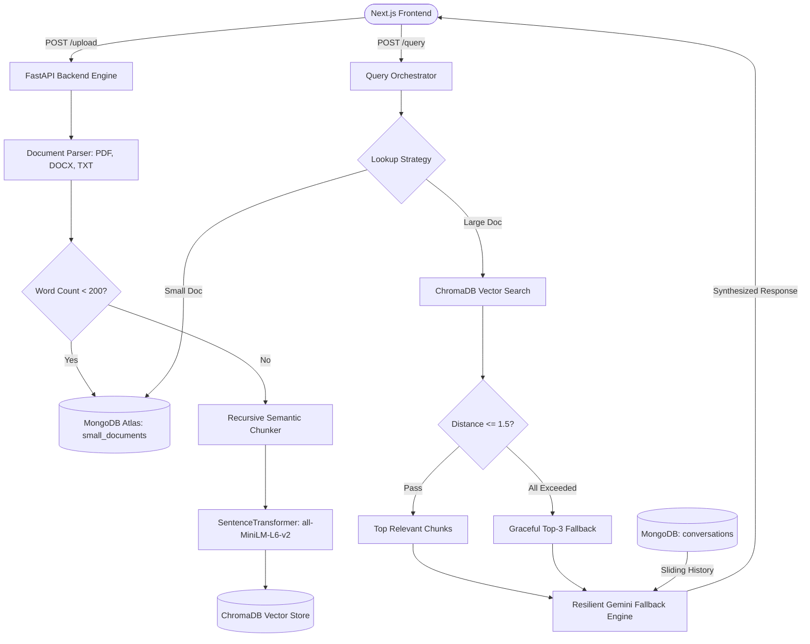

# ⚡ Full-Stack Hybrid RAG Document Q&A Pipeline

[](https://fastapi.tiangolo.com)
[](https://nextjs.org/)
[](https://ai.google.dev/)
[](https://www.trychroma.com/)
[](https://www.mongodb.com/)
[](https://www.python.org/)

An enterprise-grade, full-stack **Retrieval-Augmented Generation (RAG)** pipeline featuring **dual-tier storage routing**, **recursive semantic chunking**, **vector distance thresholding**, and an **automated LLM failover chain** for sub-second, highly resilient document intelligence.

---

## 🌟 Key Highlights & Architectural Decisions

### 1. 🧠 Dual-Tier Hybrid Document Routing
Standard RAG architectures blindly chunk every document, causing small files (resumes, single-page memos, invoices) to suffer from severe context fragmentation.
- **Short Documents (< 200 words)**: Saved directly in **MongoDB Atlas** for 100% full-context, zero-loss retrieval.
- **Large Documents ($\ge$ 200 words)**: Processed via a custom hierarchical recursive chunker and stored as 384-dimensional dense vectors in **ChromaDB**.

### 2. ✂️ Recursive Semantic Chunking
Instead of arbitrary token slicing that cuts words or sentences in half, text is chunked hierarchically:
1. Paragraph breaks (`\n\n`)
2. Line breaks (`\n`)
3. Regex lookbehind sentence boundaries (`(?<=[.?!])\s+`)
4. Word spaces (` `) with configurable sliding overlap.

### 3. 🎯 Relevance Thresholding with Graceful Degradation
- Employs squared $L_2$ distance filtering to prevent hallucinations from irrelevant chunks.
- **Graceful Fallback**: For broad semantic questions (e.g., *"What is this document about?"*), the system automatically detects high-distance distributions and falls back to the top matching chunks rather than starving the LLM with empty context.

### 4. 🛡️ High-Resilience Gemini Fallback Chain
Guarantees **99.9% query uptime** and sub-second generation by managing model rate limits and transient server spikes:
- **Primary**: `gemini-3.1-flash-lite` (low latency, zero thinking pause)
- **Secondary**: `gemini-3.5-flash-lite`
- **Tertiary**: `gemini-flash-lite-latest`
- **Safety**: `gemini-3.5-flash` with automatic exponential backoff for `503 Unavailable` / `429 Rate Limit` errors.

### 5. 🕒 Database-Native Sliding Window Memory
- Uses **MongoDB TTL Indexes** (`expireAfterSeconds: 86400`) for automated 24-hour conversational session cleanup.
- Maintains an active **sliding window** (`$slice: -20`) to feed rolling dialogue context into queries without blowing up token budgets.

---

## 🏗️ Architecture Diagram



---

## 🛠️ Tech Stack

| Component | Technology | Purpose |
| :--- | :--- | :--- |
| **Backend Framework** | **FastAPI** | High-performance asynchronous REST API |
| **Frontend Framework** | **Next.js 15 (TypeScript)** | Responsive, interactive document chat interface |
| **Vector Database** | **ChromaDB** | On-disk local persistent vector storage |
| **Embeddings** | **Sentence-Transformers** | `all-MiniLM-L6-v2` (384-dimensional dense vectors) |
| **NoSQL Database** | **MongoDB Atlas** | Full-context small documents & sliding session memory |
| **LLM Inference** | **Google GenAI SDK** | Gemini 3.1 Flash-Lite / 3.5 Flash-Lite fallback chain |
| **Document Parsers** | **pypdf**, **python-docx** | Robust multi-format text extraction |

---

## 🚀 Getting Started

### Prerequisites
- Python 3.11+
- Node.js 18+ and npm
- A free [Google AI Studio Gemini API Key](https://aistudio.google.com/)
- A free [MongoDB Atlas Database](https://www.mongodb.com/cloud/atlas)

---

### 1. Backend Setup

```bash
# Clone the repository
git clone https://github.com/your-username/your-repo-name.git
cd your-repo-name

# Create and activate virtual environment
python -m venv .venv
# On Windows:
.venv\Scripts\activate
# On Linux/macOS:
source .venv/bin/activate

# Install dependencies
pip install -r requirements.txt

# Create your .env file
cp .env.example .env
```

Edit `.env` with your credentials:
```ini
GEMINI_API_KEY=your_gemini_api_key_here
MONGODB_URI=mongodb+srv://<user>:<password>@cluster0.mongodb.net/?appName=Cluster0
```

Start the backend server:
```bash
uvicorn app:app --reload --port 8000
```
*API will be available at:* `http://localhost:8000`  
*Swagger Documentation:* `http://localhost:8000/docs`

---

### 2. Frontend Setup

```bash
cd rag-frontend

# Install dependencies
npm install

# Start the Next.js development server
npm run dev
```
*Frontend will be running at:* `http://localhost:3000`

---

## 📡 API Reference

### `POST /upload`
Uploads and processes a document (`.pdf`, `.docx`, `.txt`).
- **Payload**: `multipart/form-data` with key `file` (Max 5MB)
- **Response**:
```json
{
  "status": "ok",
  "word_count": 642,
  "mode": "retrieval"
}
```

### `POST /query`
Queries the document knowledge base with multi-turn memory.
- **Payload**:
```json
{
  "session_id": "user_session_123",
  "question": "What is the main topic of the document?",
  "filename": "proposal.pdf"
}
```
- **Response**:
```json
{
  "answer": "The document outlines a Database Systems Lab proposal...",
  "sources": ["...relevant context chunk 1...", "...relevant context chunk 2..."]
}
```

### `POST /delete`
Deletes a document from both MongoDB and ChromaDB vector collections.
- **Payload**:
```json
{
  "filename": "proposal.pdf"
}
```

---

## 🐳 Running with Docker

Run the entire backend stack with Docker:

```bash
# Build and launch container
docker compose up --build -d

# View real-time logs
docker compose logs -f
```

---

## 📄 License
This project is licensed under the MIT License.
```
