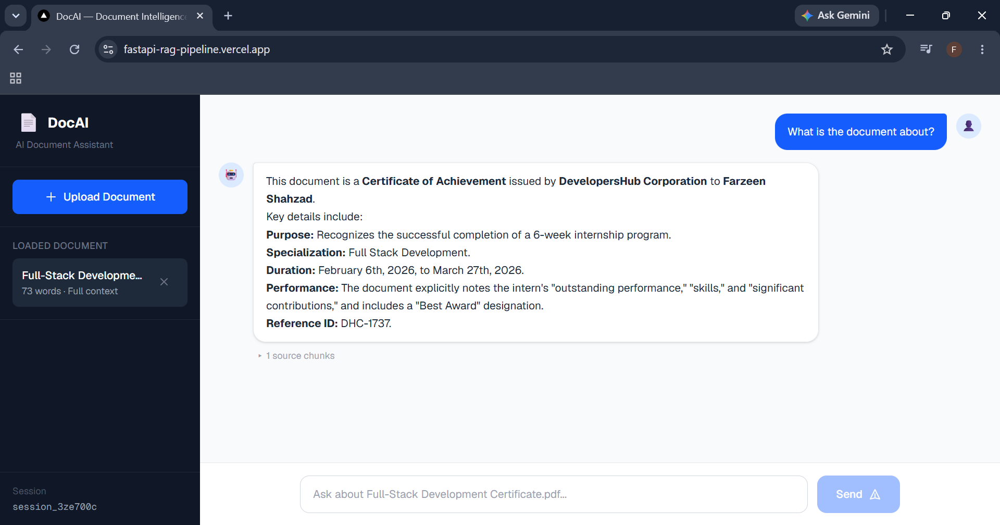
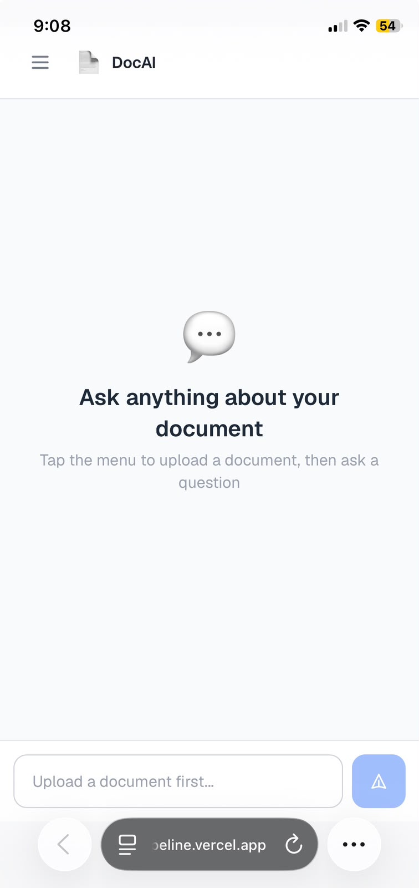
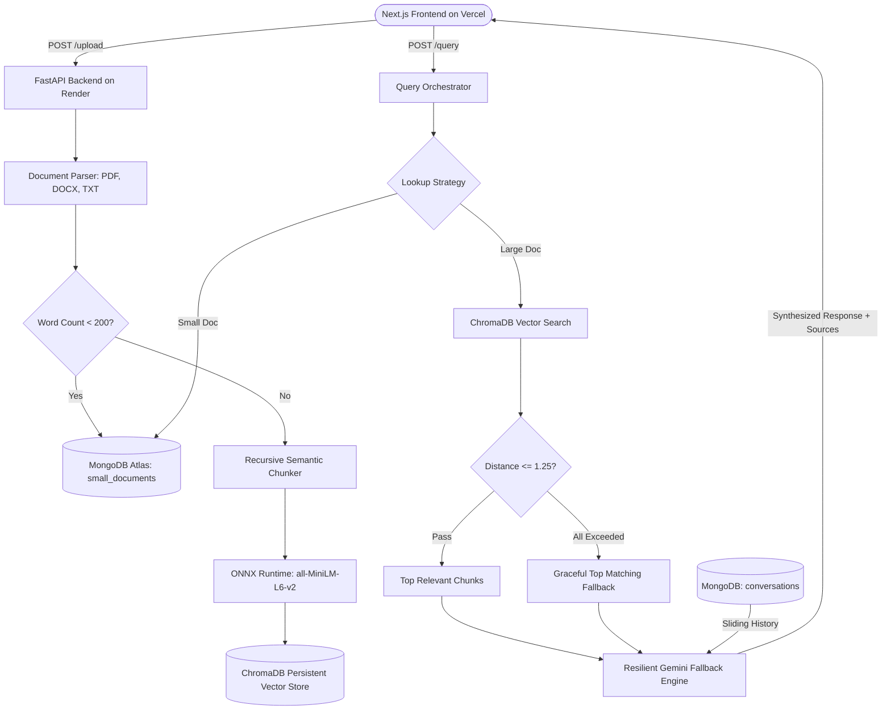

# ⚡ DocAI — Full-Stack Hybrid RAG Pipeline

[](https://fastapi.tiangolo.com)
[](https://nextjs.org/)
[](https://ai.google.dev/)
[](https://www.trychroma.com/)
[](https://www.mongodb.com/)
[](https://www.docker.com/)

An enterprise-grade, production-deployed **Retrieval-Augmented Generation (RAG)** pipeline featuring **dual-tier storage routing**, **recursive semantic chunking**, **ONNX-accelerated embeddings**, **vector distance thresholding**, and an **automated LLM failover chain** for sub-second, highly resilient document intelligence.

🔗 **Live Frontend:** [https://fastapi-rag-pipeline.vercel.app](https://fastapi-rag-pipeline.vercel.app)  
🚀 **Live Backend API:** [https://fastapi-rag-pipeline-v5si.onrender.com](https://fastapi-rag-pipeline-v5si.onrender.com)  

---

## 📸 Screenshots

| Desktop Experience | Mobile Drawer & Sources |
| :---: | :---: |
|  |  |

---

## 🌟 Key Architectural Decisions & Engineering Highlights

### 1. 🧠 Dual-Tier Hybrid Storage Routing
Standard RAG architectures blindly chunk every document, causing small files (resumes, single-page memos, invoices) to suffer from severe context fragmentation.
- **Short Documents (< 200 words)**: Ingested directly into **MongoDB Atlas** for 100% full-context, zero-loss retrieval.
- **Large Documents ($\ge$ 200 words)**: Processed via hierarchical recursive chunking and indexed as 384-dimensional dense vectors in **ChromaDB**.

### 2. ⚡ ONNX-Powered Lightweight Embeddings (6x RAM Reduction)
- Replaced heavyweight PyTorch sentence-transformer dependencies with **ONNX Runtime** via ChromaDB's native `DefaultEmbeddingFunction` (`all-MiniLM-L6-v2`).
- Slashed runtime container baseline memory from **~280 MB down to ~58 MB**, achieving identical embedding cosine similarity (1.000000) while operating reliably within low-memory container tiers.

### 3. ✂️ Hierarchical Recursive Semantic Chunking
Instead of arbitrary character/token slicing that cuts sentences in half, text is chunked hierarchically:
1. Double line breaks / Paragraph breaks (`\n\n`)
2. Single line breaks (`\n`)
3. Regex lookbehind sentence boundaries (`(?<=[.?!])\s+`)
4. Word boundaries with configurable sliding overlap (600 characters / 100 character overlap).

### 4. 🎯 Relevance Thresholding with Graceful Degradation
- Employs squared $L_2$ distance filtering (`max_distance = 1.25`) to prevent hallucinations from irrelevant chunks.
- **Graceful Fallback**: For broad semantic queries (e.g., *"What is this document about?"*), the system automatically detects high-distance distributions and falls back to top matching context rather than starving the LLM with an empty prompt.

### 5. 🛡️ High-Resilience Gemini Fallback Chain
Guarantees **99.9% query uptime** and sub-second generation by managing model rate limits and transient server spikes:
- **Primary**: `gemini-3.1-flash-lite` (ultra-low latency, zero thinking overhead)
- **Secondary**: `gemini-3.5-flash-lite`
- **Tertiary**: `gemini-flash-lite-latest`
- **Safety**: `gemini-3.5-flash` with automatic exponential backoff for `503 Unavailable` / `429 Rate Limit` errors.

### 6. 🕒 Database-Native Sliding Window Memory
- Uses **MongoDB TTL Indexes** (`expireAfterSeconds: 86400`) for automated 24-hour conversational session cleanup.
- Maintains an active **sliding window** (`$slice: -20`) to feed rolling dialogue context into queries without blowing up token budgets.

### 7. 📱 Mobile-First Responsive Experience
- Next.js 15 frontend featuring a responsive slide-in navigation drawer for mobile devices.
- Automatic container wake-up ping on page load to pre-warm the cold backend.
- Built-in retry mechanism with a live countdown timer and non-blocking status banners.

---

## 🏗️ Architecture Diagram



---

## 🛠️ Tech Stack

| Component | Technology | Purpose |
| :--- | :--- | :--- |
| **Backend Framework** | **FastAPI** | High-performance asynchronous REST API |
| **Frontend Framework** | **Next.js 15 (TypeScript)** | Responsive chat interface with mobile slide-in drawer |
| **Vector Database** | **ChromaDB** | Local on-disk persistent vector database |
| **Embedding Engine** | **ONNX Runtime** | `all-MiniLM-L6-v2` dense vectors (384-dim, low-memory) |
| **NoSQL Database** | **MongoDB Atlas** | Full-context storage for small documents & session memory |
| **LLM Inference** | **Google GenAI SDK** | Resilient Gemini Flash-Lite multi-tier fallback chain |
| **Containerization** | **Docker** | Multi-stage lightweight CPU deployment |
| **Deployment** | **Vercel + Render** | Production serverless frontend & containerized backend |

---

## 🚀 Local Development

### Prerequisites
- Python 3.11+
- Node.js 18+ and npm
- [Google AI Studio Gemini API Key](https://aistudio.google.com/)
- [MongoDB Atlas Account](https://www.mongodb.com/cloud/atlas)

---

### 1. Backend Setup

```bash
# Clone the repository
git clone https://github.com/farzeen-code/Fastapi-rag-pipeline.git
cd Fastapi-rag-pipeline

# Create and activate virtual environment
python -m venv .venv
# On Windows:
.venv\Scripts\activate
# On Linux/macOS:
source .venv/bin/activate

# Install dependencies
pip install -r requirements.txt

# Configure environment variables
# Create a .env file with:
# GEMINI_API_KEY=your_gemini_api_key
# MONGODB_URI=your_mongodb_connection_string

# Run development server
uvicorn app:app --reload --port 8000
```
*API docs available at:* `http://localhost:8000/docs`

---

### 2. Frontend Setup

```bash
cd rag-frontend

# Install dependencies
npm install

# Start development server
npm run dev
```
*Frontend running at:* `http://localhost:3000`

---

## 📡 API Endpoints

### `POST /upload`
Uploads and indexes documents (`.pdf`, `.docx`, `.txt`).
- **Body**: `multipart/form-data` with `file`
- **Response**:
```json
{
  "status": "ok",
  "word_count": 642,
  "mode": "retrieval"
}
```

### `POST /query`
Queries the document knowledge base with multi-turn memory.
- **Body**:
```json
{
  "session_id": "session_abc123",
  "question": "What are the core qualifications mentioned?",
  "filename": "document.pdf"
}
```
- **Response**:
```json
{
  "answer": "The candidate has expertise in Python, C++, and MERN stack...",
  "sources": ["Relevant context snippet 1...", "Relevant context snippet 2..."]
}
```

### `POST /delete`
Removes a document from both vector storage and MongoDB collections.

---

## 📄 License
Distributed under the MIT License. See `LICENSE` for more information.
